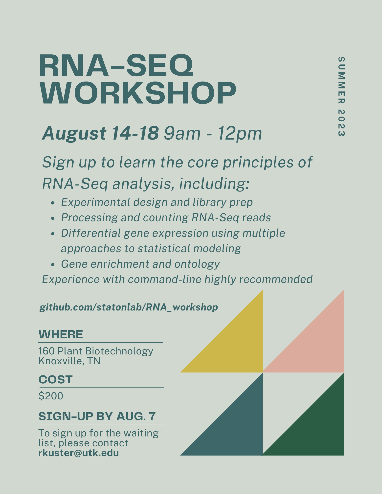

# RNA-Seq Workshop

Welcome to the 2023 RNA-Seq Workshop! This workshop is being offered to all UTK students, staff, and faculty as an intensive, one-week dive into designing and analyzing RNA-Seq data.

The workshop cost is $200 per attendee, and sign up ends August 7th.

Interested? Contact rkuster@utk.edu.

*This workshop is contingent on enrollment, so please don't hesitate to request a spot!*

**Prerequisite knowledge :** This workshop requires a working knowledge of navigating and using a command line environment. If you're not comfortable using command line, consider signing up for the two day [Command Line Workshop](https://github.com/statonlab/CLI_workshop) being offered the week prior to the RNA-Seq workshop.

For course content, please see the [wiki](https://github.com/statonlab/RNA_workshop/wiki).

